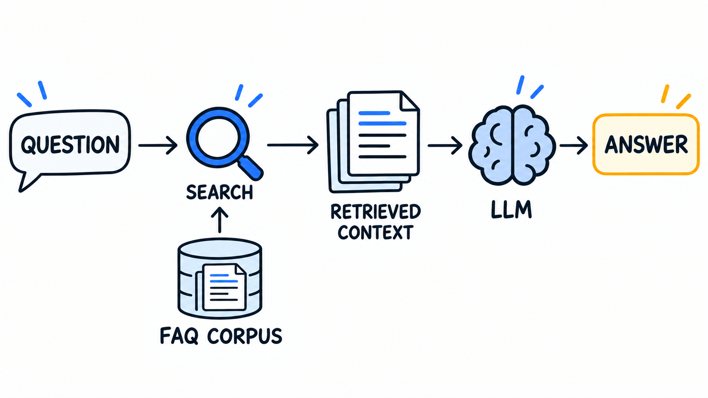

# Module 5: Monitoring

Offline evaluation can't tell you how your RAG system performs once real
people use it. This module covers online monitoring: collecting metrics
from real traffic and visualizing them on a dashboard.

We build a Streamlit chat app, capture metrics, store conversations
in PostgreSQL, and create Grafana dashboards for real-time monitoring.

## Lessons

Work through them in order:

1. [Intro](lessons/01-intro.md) - Why monitoring matters, what we'll build
2. [Assistant Setup](lessons/02-assistant-setup.md) - Setting up the RAG assistant
3. [Chat App](lessons/03-chat-app.md) - Basic Streamlit app with RAG
4. [Capturing Metrics](lessons/04-metrics.md) - LLMCallRecord, cost tracking
5. [Database](lessons/05-database.md) - PostgreSQL with Docker, saving conversations
6. [Querying Data](lessons/06-querying.md) - Fetching stored conversations
7. [Streamlit Dashboard](lessons/07-streamlit-dashboard.md) - Visualizing metrics in Streamlit
8. [User Feedback](lessons/08-user-feedback.md) - Thumbs up/down buttons
9. [Built-in Judge](lessons/09-built-in-judge.md) - LLM-as-a-judge for automatic relevance evaluation
10. [Feedback Dashboard](lessons/10-feedback-dashboard.md) - Adding feedback panels to the Streamlit dashboard
11. [Synthetic Data](lessons/11-synthetic-data.md) - Generating test data for dashboards
12. [Grafana Dashboards](lessons/12-grafana.md) - SQL queries and dashboard panels
13. [Docker Compose](lessons/13-docker-compose.md) - Running everything together
14. [Next Steps](lessons/14-next-steps.md) - OpenTelemetry, alerting, frameworks to learn more

## The project

RAG solves these problems by giving the LLM relevant documents at
question time. We don't hope the model memorized the answer. We
retrieve the right information and hand it to the LLM, and the model
generates a grounded response. This lets us inject knowledge the model
never saw during training. That's why RAG is still the most common way
people use LLMs in the industry.

To make this concrete, we build a FAQ agent for our course. A student
asks something like "when does the course start?" and the agent answers
from the FAQ data we prepared.

